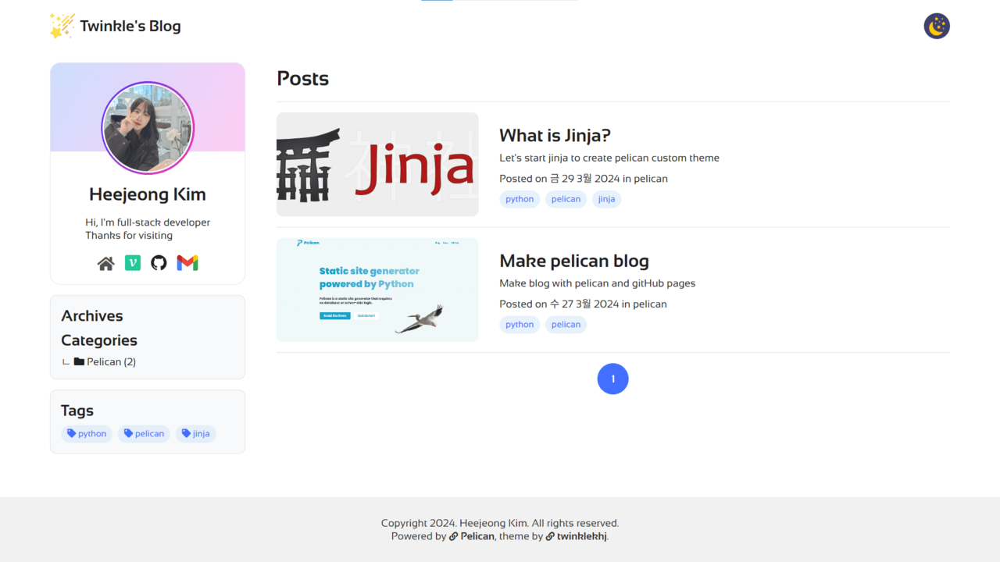
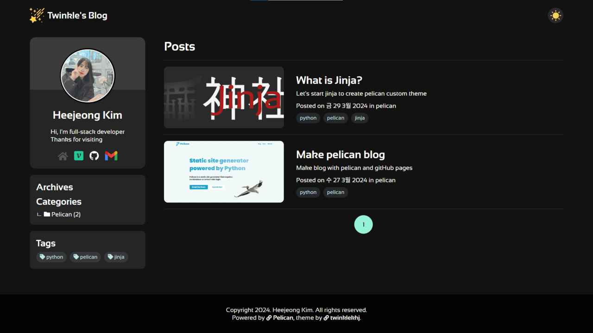

# Twinkle

Twinkle is a `velog` style self-made theme.
a few changes for use with [Pelican](https://getpelican.com/).

<br>

## Demo

You can see the demo or source code
* demo: https://twinklekhj.xyz/blog/
* code: https://github.com/twinklekhj/pelican-twinkle

<br>

> Light Theme




> Dark Theme
> 


<br>

## Plugins
Installed plugins for extensions. <br>
You can see the more information about [Pelican plugins](https://github.com/pelican-plugins).

- `share_post`: to share article to social
- `representatice_image`: to display preview image in list
- `neighbors`: to display previous/next in article page
- `sitemap`: to generate sitemap.xml

<br>

## Features
- Theme: `Light`/`Dark` Theme
- Responsive: pc, tablet, mobile
- Code blocks: Syntax **highlighting** and **Mac** styling 
- Comment: Disqus
- Share post link to social

<br>

## Install
Download the [repository](https://github.com/wting/pelican-svbtle) and save
it somewhere accessible.

Edit `pelicanconf.py` and modify the `THEME` variable
to point to the downloaded theme location.

```python
THEME = "path/to/themes/twinkle"
THEME_STATIC_DIR = 'theme'
```

<br>

## Settings

These are the Pelican global variables currently supported by the theme <br>
modify `pelicanconf.py` file for setting


### Jinja Environment
required jinja extensions for **break** in loop

```python
# JINJA
JINJA_ENVIRONMENT = {
    'extensions': ['jinja2.ext.loopcontrols']
}
```

### Plugins
plugins for theme

```python
# PLUGINS
PLUGIN_PATHS = ['./themes/twinkle/plugins']
PLUGINS = [
    'pelican.plugins.sitemap',
    'representative_image',
    'share_post',
    'neighbors'
]
```

### Sitemap
```python
# PLUGIN - sitemap
SITEMAP = {
    'format': 'xml'
}
```

### Sidebar
```python
# Author Info
AUTHOR = "Heejeong Kim"
AUTHOR_INFO = {
    "GITHUB": "hjkim1004",
    "DESCRIPTION": "Hi, I'm full-stack developer<br>Thanks for visiting"
}

# Author Links
LINKS = (
    ("home", "https://twinklekhj.xyz", "fontawesome"),
    ("velog", "https://velog.io/@developer_khj", "image"),
    ("github", "https://github.com/hjkim1004", "image"),
    ("gmail", "mailto:developer.heejeong@gmail.com", "image"),
)
```

Write `AUTHOR_INFO`, then create profile section include github profile image.

Write `LINKS`, then create link for profile section
```python
LINKS = (("id", "link", "type"))

# type: fontawesome | image
# if link has type "image"
#   then create icon ''
# else
#   then create icon '<i class="fas fa-{id}"></i>
```

### OG
This theme generate og tag automatic using below variable

```python
# OG METADATA
OG_TITLE = SITENAME
OG_DESCRIPTION = AUTHOR_INFO["DESCRIPTION"]
```

### ETC
- `DISQUS_SITENAME`
- `DEFAULT_DATE_FORMAT = ('%b %d, %Y')`: suggested date format

When developing locally, set the following variable: <br>
`SITEURL = http://localhost:8000`


## Modification
you can customize the theme by editing css-variable
- general: `./static/css/style.less`.
- dark: `./static/css/dark.less`
- responsive: `./static/css/mobile.less`

```css
:root {
  --body-color: #222;
  --body-bg-color: white;
  --main-color: #426fff;
  --main-bg-color: #f8f9fa;
  --element-color: #426fff;
  --element-bg-color: rgb(209 228 248 / 50%);
  --header-color: #222;
  --header-bg-color: white;
  --header-bs-color: rgba(0, 0, 0, 0.08);
  --header-size: 80px;
  --sidebar-color: #222;
  --sidebar-bg-color: white;
  --sidebar-size: 300px;
  --footer-color: #333;
  --footer-bg-color: #f1f1f1;
  --footer-size: 100px;
  --fs-title: 4rem;
  --fs-1: 2.5rem;
  --fs-2: 2.25rem;
  --fs-3: 2rem;
  --fs-4: 1.75rem;
  --fs-5: 1.5rem;
  --fs-6: 1.25rem;
  --fs-7: 1rem;
}
```

## Author

Written by `Heejeong Kim`

